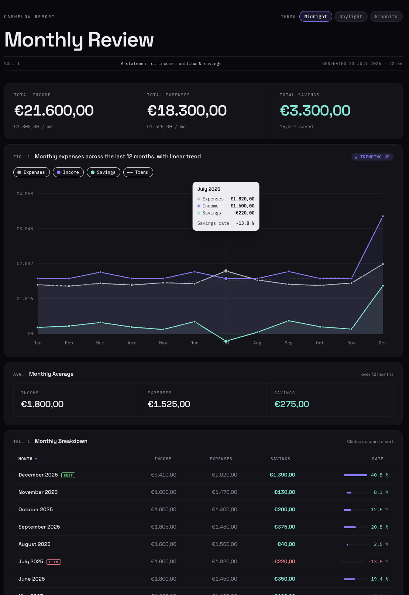
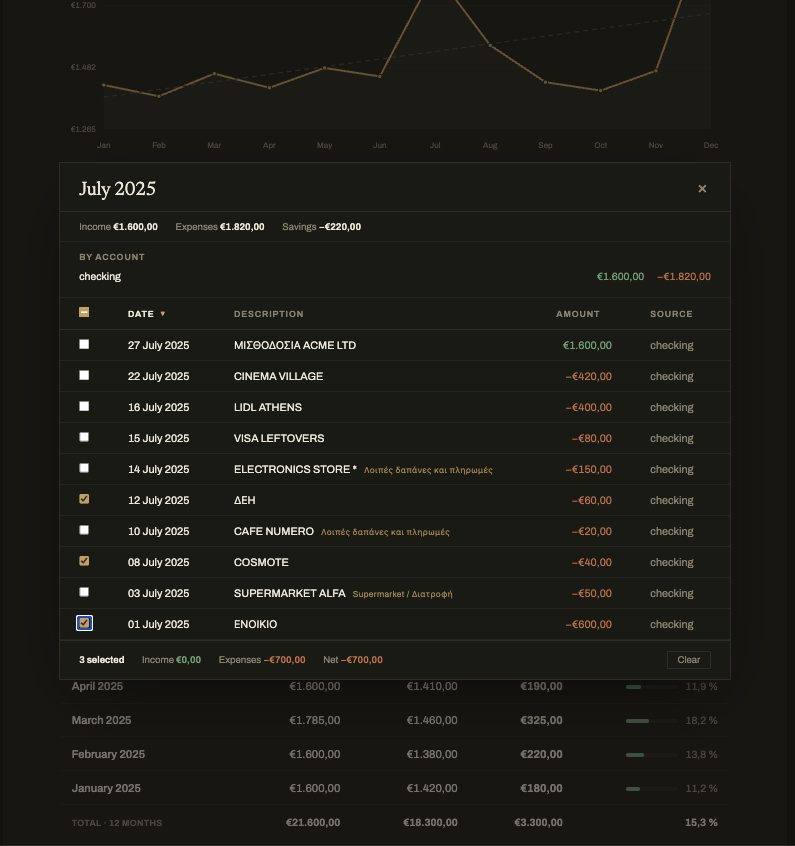

# cashflow-report

Summarises bank transactions into an interactive HTML report. Use it from a
browser (no terminal needed) or from the command line.

> **Supported format:** the application currently only reads **Greek Alpha Bank
> `.csv` exports** (semicolon-separated, with the Greek column headers and
> `1.550,00`-style amounts shown below). Exports from other banks are not yet
> supported. See [CSV format](#csv-format) for an example.

## Screenshots

The report summarises total income, expenses, and savings, with a 12-month
trend chart and a per-month breakdown:



Click any month to open a modal listing that month's individual transactions,
grouped by account and sortable by column:



## Download

Prebuilt binaries are published automatically on the
[**Releases**](https://github.com/lpatouchas/cashflow-report/releases) page. A
GitHub Actions workflow ([`.github/workflows/release.yml`](.github/workflows/release.yml))
cross-compiles the app for Windows, macOS, and Linux on every version tag and
attaches the binaries — plus a `checksums.txt` — to the corresponding release. No
Go toolchain needed: download the file for your platform and run it.

| Platform                        | File                                |
| ------------------------------- | ----------------------------------- |
| Windows (most PCs)              | `cashflow-report-windows-amd64.exe` |
| Windows on ARM                  | `cashflow-report-windows-arm64.exe` |
| macOS (Apple Silicon, M1–M4)    | `cashflow-report-darwin-arm64`      |
| macOS (Intel)                   | `cashflow-report-darwin-amd64`      |
| Linux (most PCs)                | `cashflow-report-linux-amd64`       |
| Linux on ARM                    | `cashflow-report-linux-arm64`       |

Prefer building from source? See [Quick start](#quick-start-web-app) below.

## Quick start (web app)

1. Build the binary once, or
   [download a prebuilt one](#download):

   ```bash
   go build -o cashflow-report .
   ```

2. Double-click `cashflow-report` (or run `./cashflow-report`). Your browser
   opens to a local page.
3. Drop your bank CSV exports onto the page and click **Generate report**.

The server listens on `http://localhost:8080`. Use `--no-open` to skip opening
the browser, or `--addr :1234` to change the port:

```bash
./cashflow-report serve --addr :1234 --no-open
```

## Command line

Generate a report headlessly from a folder of CSV exports:

```bash
./cashflow-report generate --data ./data --out ./report.html
```

`--data` defaults to `./data` and `--out` to `./report.html`. Then open the
generated `report.html`.

Use `--config path/to/rules.json` with `generate` or `serve` to choose a
different exclusion-rules file.

### Sample data

A small fictional dataset lives in [`sample-data/`](sample-data/) (a `checking`
and a `savings` account, calendar year 2025) so you can try the report without
your own exports:

```bash
./cashflow-report generate --data ./sample-data --out ./report.html
```

It averages €1,800/month income and €1,500/month expenses, with a December
double salary (the Greek *Δώρο Χριστουγέννων*). The monthly transfers from
checking to savings share a transaction ID across both files, so they show up
as excluded inter-account transfers rather than income/expenses.

## Using make

A `Makefile` wraps the common commands. Run `make help` to list targets:

```bash
make build      # build the cashflow-report binary
make serve      # build, then start the web app (ADDR=:8080)
make generate   # build, then generate a report (DATA=./data OUT=./report.html)
make test       # run the test suite
make clean      # remove the binary and coverage.out
```

Override the defaults on the command line, for example:

```bash
make serve ADDR=:1234
make generate DATA=./exports OUT=./out.html
```

## What it does

- Loads every `*.csv` in the data folder (Greek Alpha Bank export format; see
  [CSV format](#csv-format)).
- Excludes inter-account transfers: any transaction ID (`Αρ. συναλλαγής`)
  appearing more than once across the loaded files is treated as a transfer or
  duplicate and left out of the totals.
- Applies user-defined exclusion rules. Rules live in `exclusion-rules.json`
  (created next to the binary on first run, pre-filled with the built-in
  instant-transfer rule). Each rule matches a transaction by description
  (exact or contains), optionally constrained to debit/credit and a single
  source file. Edit rules right on the web page (tick "Save these rules for
  next time" to persist them), or point at a different file with `--config`.
- Reports total income, expenses, and savings, plus a per-month breakdown.
- The report's monthly table is interactive: click a month to open a modal
  listing that month's individual transactions, sortable by any column.

## CSV format

The application currently only supports **Greek Alpha Bank `.csv` exports**.
These files are semicolon-separated (`;`), use Greek column headers, and format
amounts the Greek way (`.` for thousands, `,` for decimals). String fields are
wrapped as `="..."` (the spreadsheet escaping Alpha Bank uses).

The first row is the header, followed by one row per transaction:

```csv
Α/Α;Ημερομηνία;Αιτιολογία;Κατάστημα;Τοκισμός από;Αρ. συναλλαγής;Ποσό;Πρόσημο ποσού;
1;29/05/2026;="SUPERMARKET ATHENS";99;27/5/2026;="202605290990022734";53,79;Χ;
27;18/05/2026;="SALARY John DOE";96;18/5/2026;="202605180960379907";1.550,00;Π;
```

The columns the report relies on are:

| Column         | Header           | Example                 | Notes                                        |
| -------------- | ---------------- | ----------------------- | -------------------------------------------- |
| Date           | `Ημερομηνία`     | `29/05/2026`            | `DD/MM/YYYY`                                 |
| Description    | `Αιτιολογία`     | `="SUPERMARKET ATHENS"` | Wrapped in `="..."`                          |
| Transaction ID | `Αρ. συναλλαγής` | `="202605290990022734"` | Used to detect inter-account transfers       |
| Amount         | `Ποσό`           | `1.550,00`              | Greek number format (`.`/`,`)                |
| Sign           | `Πρόσημο ποσού`  | `Χ` or `Π`              | `Χ` = debit (expense), `Π` = credit (income) |

Rows with too few columns, an unparseable date or amount, or a sign other than
`Χ`/`Π` are skipped with a warning.

## Development

```bash
go test ./...   # run the test suite
```
